# Работа с whitelist-bypass

## Установка и запуск

1. Для установки скачиваем apk и десктопную программу из релизов

2. Перед запуском на андроиде необходимо убедиться, что в настройках DNS выбрано "Автоматически"

3. Запускаем десктоп:

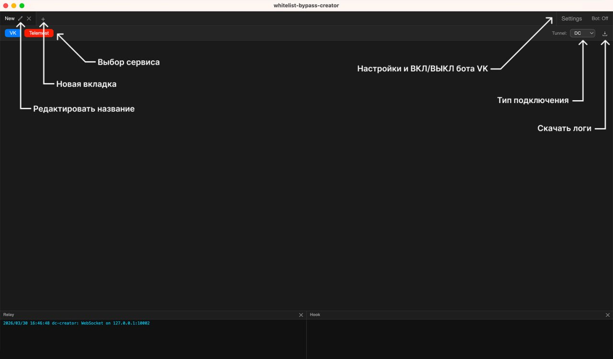

4. Запускаем приложение. Tunnel должен совпадать с тем, что выбран на десктопе

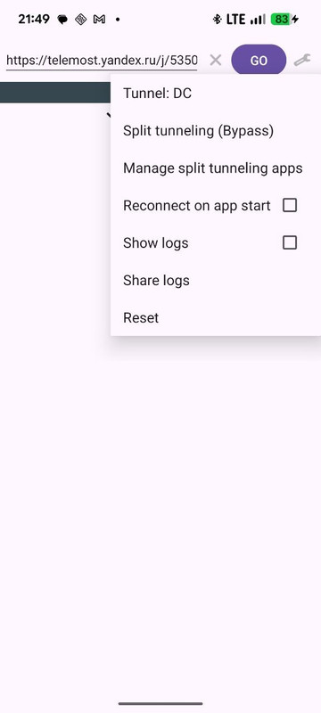

## Настройка бота VK

Чтобы автоматически создавать звонки и получать ссылки без доступа к Creator - можно использовать бота ВКонтакте.

Для этого нужно создать сообщество (Можно приватное)

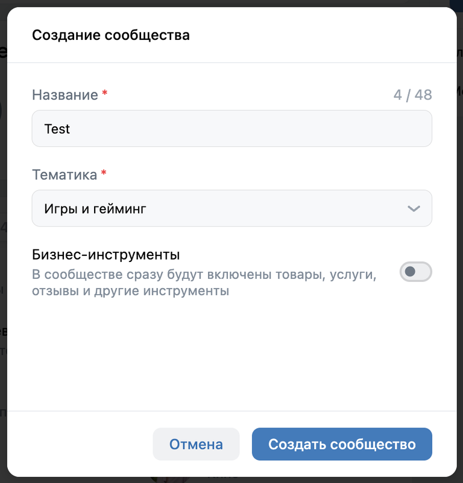

На главной странице сообщества перейдите в раздел "Управление"

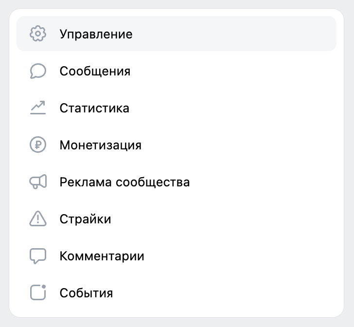

В настройках сообщества раскройте раздел "Дополнительно" и перейдите в раздел "Работа с API"

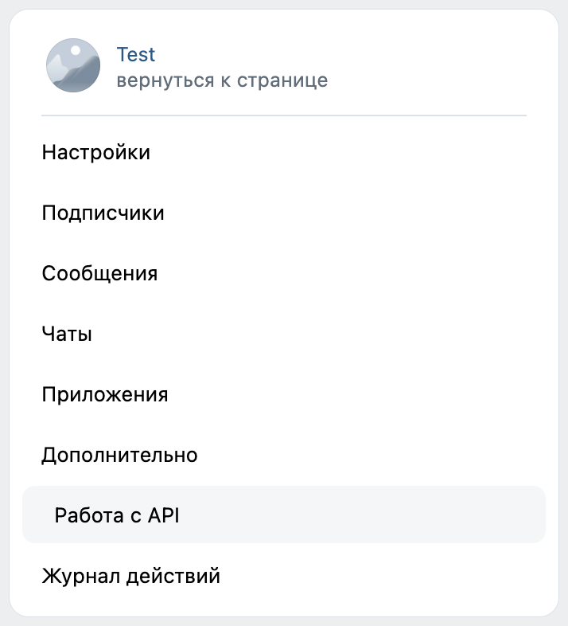

Нажмите кнопку "Создать ключ", проставьте все галочки и подтвердите создание.

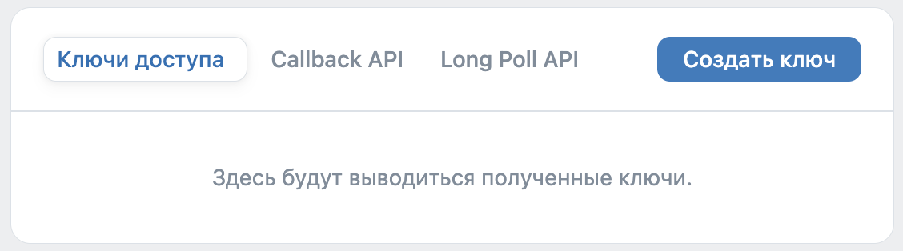
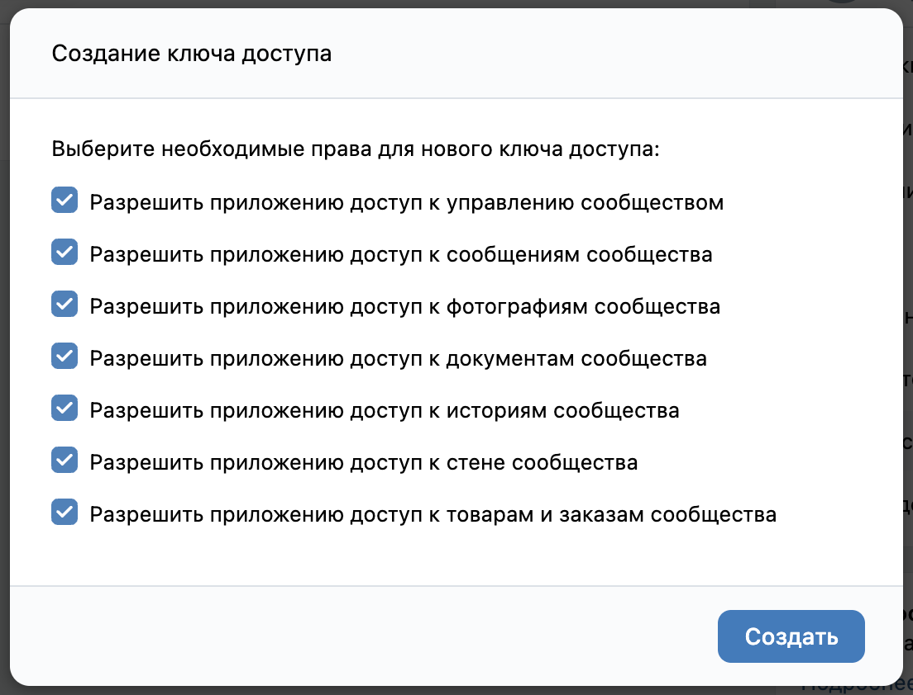

Подтвердите создание ключа кодом из SMS, после этого рекомендую сразу скопировать ключ, ведь последующее копирование будет сопровождаться подтверждением кода из SMS.

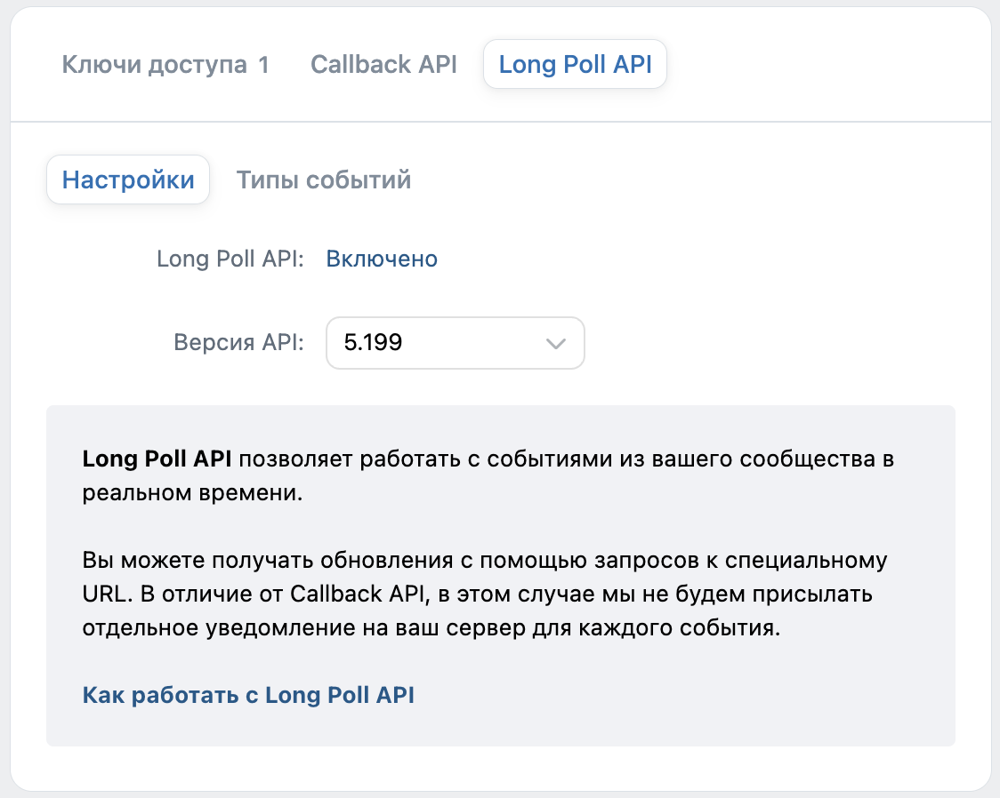

Перейдите в раздел Long Poll API и включите его. Там же, в разделе "Типы событий" в подразделе сообщения проставьте все галочки. Изменения применятся автоматически

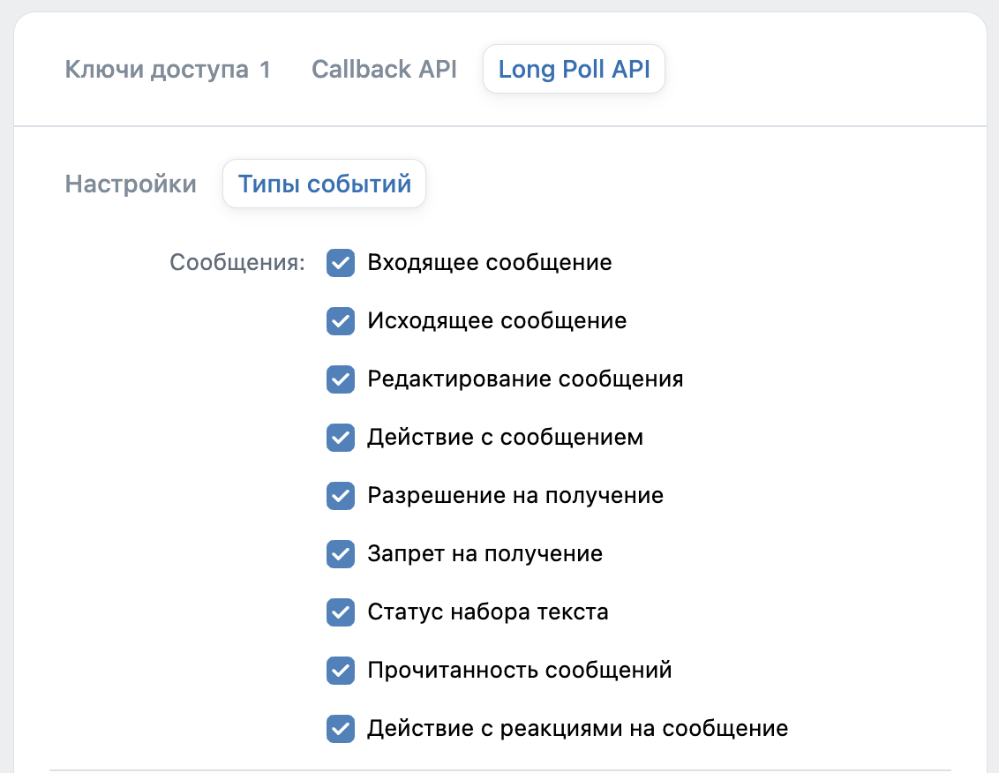

Затем в правом сайдбаре, в разделе "Сообщения" выберите пункт "Настройки для бота" и включите "Возможности ботов"

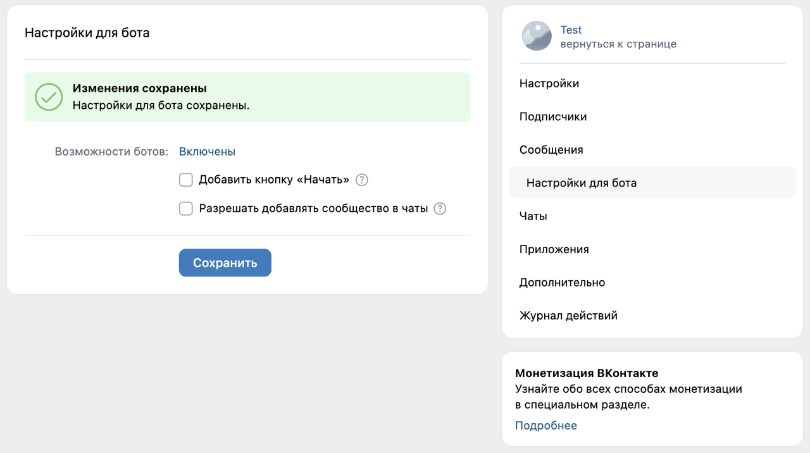

В разделе "Настройки" сообщества в правом сайдбаре скопируйте id (адрес) сообщества без "club", только цифры.

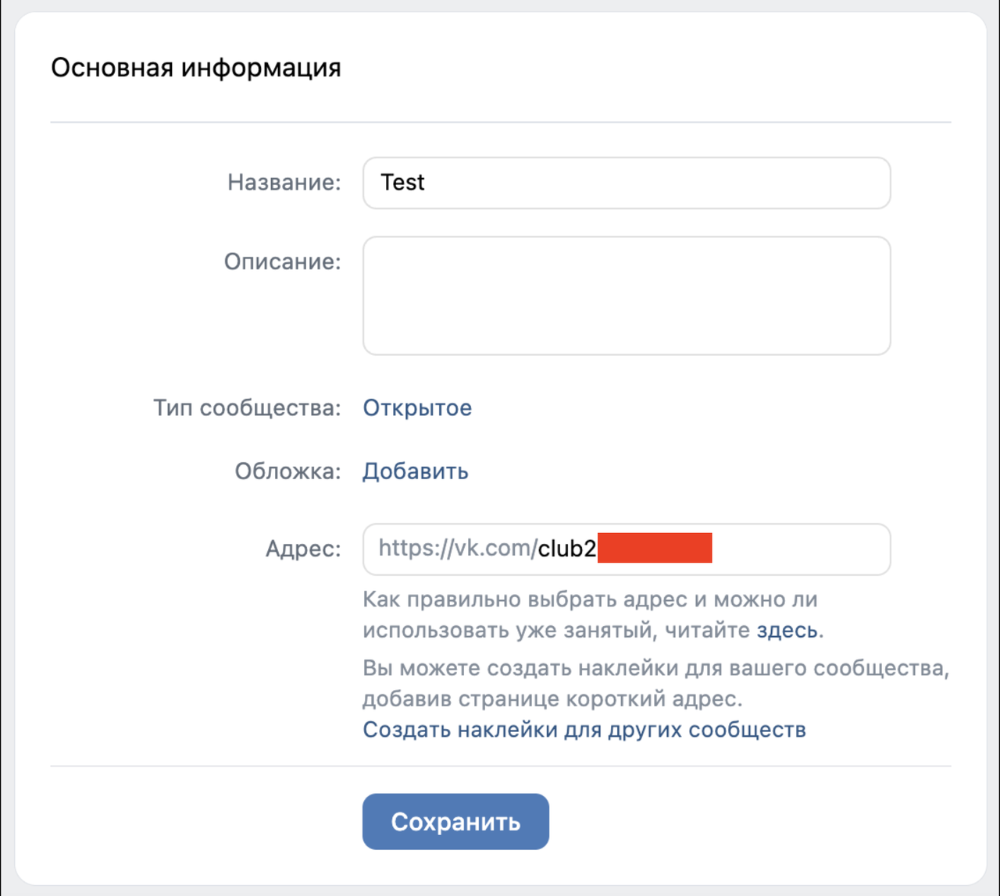

Теперь необходимо узнать свой ID, он необходим для работы бота в целях безопасности, чтобы тот не отвечал и не давал ссылки кому попало. Для этого кликните на иконку своего профиля, нажмите на кнопку "Управление аккаунтом VK ID", на открывшейся странице перейдите в раздел "Мои данные", вверху будет ваш ID.

После сбора всех данных заполните настройки бота в Creator. Сохраните и запустите бота.

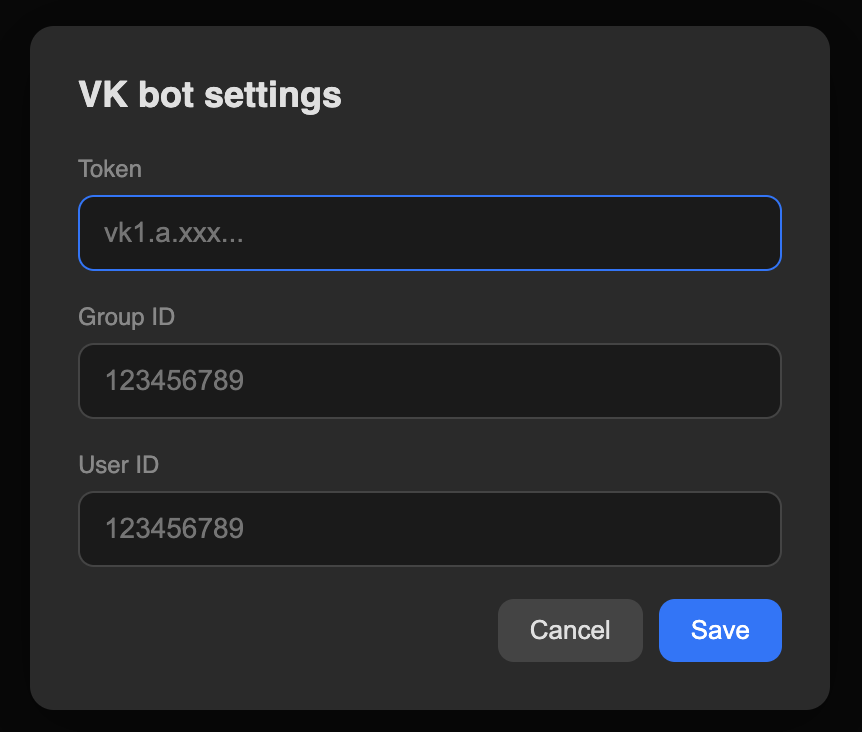

## Команды бота

Протестируйте работу бота:

- `/vk dc` - создает звонок ВКонтакте в режиме DC
- `/vk video` - создает звонок ВКонтакте в режиме Video
- `/tm dc` - создает звонок в Telemost в режиме DC
- `/tm video` - создает звонок в Telemost в режиме Video

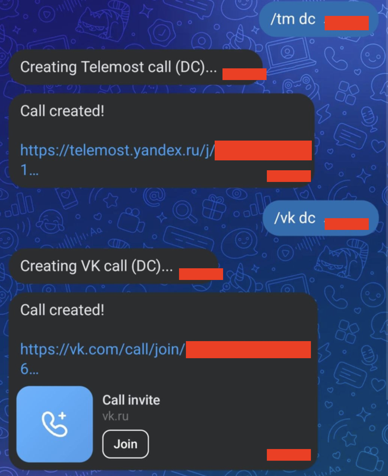

---

[Блог автора](https://t.me/markovdrankthechains)
